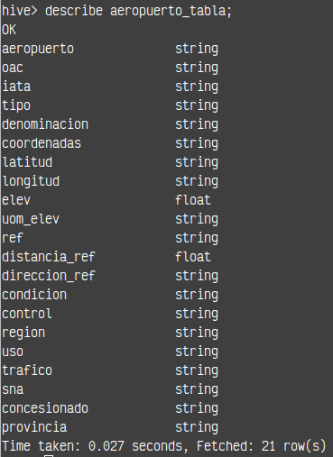

# Ejercicio 1 Final EDVAI

## 1 - 1. Hacer ingest de los siguientes files relacionados con transporte aéreo de Argentina :
2021:<br>
https://dataengineerpublic.blob.core.windows.net/data-engineer/2021-informe-ministerio.csv

2022:<br>
https://dataengineerpublic.blob.core.windows.net/data-engineer/202206-informe-ministerio.csv

Aeropuertos_detalles:<br>
https://dataengineerpublic.blob.core.windows.net/data-engineer/aeropuertos_detalle.csv

Ejecutar el script 01_ingest_data.sh, este archivo realiza la descarga de los datos y posteriormente hace el put en hdfs

```
# Darle permisos de ejecucion
chmod +x /home/hadoop/scripts/Ejercicio_1/01_scripts/01_ingest_data.sh

# Ejecucion
./home/hadoop/scripts/Ejercicio_1/01_scripts/01_ingest_data.sh
```

<b>SOLUCIÓN: [01_scripts/01_ingest_data.sh](01_scripts/01_ingest_data.sh)<b/>

## 2 - Crear 2 tablas en el datawarehouse, una para los vuelos realizados en 2021 y 2022 (2021-informe-ministerio.csv y 202206-informe-ministerio) y otra tabla para el detalle de los aeropuertos (aeropuertos_detalle.csv)

### Tabla `aeropuerto_tabla`

| Columna          | Tipo     |
|------------------|----------|
| aeropuerto       | string   |
| oac              | string   |
| iata             | string   |
| tipo             | string   |
| denominacion     | string   |
| coordenadas      | string   |
| latitud          | string   |
| longitud         | string   |
| elev             | float    |
| uom_elev         | string   |
| ref              | string   |
| distancia_ref    | float    |
| direccion_ref    | string   |
| condicion        | string   |
| control          | string   |
| region           | string   |
| uso              | string   |
| trafico          | string   |
| sna              | string   |
| concesionado     | string   |
| provincia        | string   |

### Tabla `aeropuerto_detalles_tabla`

| Columna                 | Tipo   |
|-------------------------|--------|
| fecha                   | date   |
| horautc                 | string |
| clase_de_vuelo          | string |
| clasificacion_de_vuelo  | string |
| tipo_de_movimiento      | string |
| aeropuerto              | string |
| origen_destino          | string |
| aerolinea_nombre        | string |
| aeronave                | string |
| pasajeros               | int    |

Para este punto se crearon 2 archivos sql. Dentro de cada archivo esta la creacion de la base de dato si esta no existe llamada aviaciondb y posteriormente la creacion de las tablas solicitadas en el enunciado. Los archivos deben ser ejecutados por hive, se procedio de esta manera para facilitar la escritura del codigo sql.

Ejecutamos lo siguiente:
```
hive -f /home/hadoop/scripts/Ejercicio_1/02_create_table/create_table1.sql

hive -f /home/hadoop/scripts/Ejercicio_1/02_create_table/create_table2.sql
```

<b>SOLUCIÓN: 
* [aeropuerto_detalles_tabla](02_create_table/create_table1.sql)
* [aeropuerto_tabla](02_create_table/create_table2.sql)
<b/>

Luego en hive podemos ver si todo se creo correctamente
```
# EL siguiente comando deberia listar las bd y deberia existir la base de dato "aviaciondb"
SHOW DATABASES;

# Seleccionamos la bd
USE aviaciondb;

# Listamos las tablas, si todo esta correcto deberian existir las tablas siguientes: [aeropuertos_detalle, vuelos_2021_2022]
SHOW TABLES

```

## 3 - Realizar un proceso automático orquestado por airflow que ingeste los archivos previamente mencionados entre las fechas 01/01/2021 y 30/06/2022 en las dos tablas creadas.<br>
* Los archivos 202206-informe-ministerio.csv y 202206-informe-ministerio.csv → en la tabla aeropuerto_tabla
* El archivo aeropuertos_detalle.csv → en la tabla aeropuerto_detalles_tabla

<b>SOLUCIÓN: [03_airflow/elt-dag.py](03_airflow/elt-dag.py)<b/>

## 4 - Realizar las siguiente transformaciones en los pipelines de datos:
* Eliminar la columna inhab ya que no se utilizará para el análisis
* Eliminar la columna fir ya que no se utilizará para el análisis
* Eliminar la columna “calidad del dato” ya que no se utilizará para el análisis
* Filtrar los vuelos internacionales ya que solamente se analizarán los vuelos domésticos
* En el campo pasajeros si se encuentran campos en Null convertirlos en 0 (cero)
* En el campo distancia_ref si se encuentran campos en Null convertirlos en 0 (cero)

Nota: Los primeros 3 items no se realizaron ya que los esquemas de tabla donde se ingestaron los datos no existian las columnas inhab, fir y calidad del dato. En caso de error en la estructura de tabla, la eliminación de columnas se haría de la siguiente manera:

```
# codigo pyspark

columnas_a_eliminar = ['inhab', 'fir', 'calidad del dato']
df = df.drop(*columnas_a_eliminar)
```

<b>SOLUCIÓN: [03_airflow/05_transform.py](03_airflow/05_transform.py)<b/>

## 5 - Mostrar mediante una impresión de pantalla, que los tipos de campos de las tablas sean los solicitados en el datawarehouse (ej: fecha date, aeronave string, pasajeros integer, etc.)

### Capturas de tablas desde <b>dbeaver</b>


### Capturas de tablas desde <b>hive</b>



## Ejercicio 6, 7, 8, 9 y 10

Se realizaron en una notebook para mayor agilidad en el desarrollo.

<b>SOLUCIÓN: [05_queries/pyspqrk_queries.py](05_queries/pyspqrk_queries.py)<b/>


## 11. Qué datos externos agregaría en este dataset que mejoraría el análisis de los datos

Datos externos:
* Datos meteorológicos: Información sobre las condiciones climáticas en las fechas y ubicaciones de los vuelos. Los datos nombrados, pueden ayudar a entender retrasos, cancelaciones y su impacto en la cantidad de vuelos y pasajeros.

* Datos económicos y precios del boleto: Información sobre indicadores económicos como el PIB, el ingreso per cápita y la tasa de desempleo en las regiones de origen y destino de los vuelos. Esto puede ayudar a entender la demanda de vuelos.

* Eventos especiales: Calendarización sobre eventos especiales, como ferias, conferencias y eventos deportivos, que pueden influir en el número de vuelos y pasajeros.

* Datos de satisfacción del cliente: Encuestas y opiniones de los pasajeros sobre su experiencia de vuelo, que pueden proporcionar información valiosa sobre la calidad del servicio y áreas de mejora.

## 12. Conclusiones y recomendaciones sobre este proyecto
El dataset proporcionado permite realizar un análisis detallado del tráfico aéreo incluyendo la cantidad de vuelos y pasajeros, así como las aerolíneas y aeronaves más utilizadas. Estos datos permiten identificar patrones y tendencias que permitan optimizar la gestión de los vuelos. Es recomendable ampliar los datos con datos externos ya que con la adición de datos del enunciado 11, se pueden identificar áreas de mejora en el servicio ofrecido por las aerolíneas y aeropuertos además si se contara con datos meteorológicos y eventos especiales permitiría proporcionar una visión más completa de los factores que afectan el tráfico aéreo.

## 13. Proponer una arquitectura alternativa para este proceso ya sea con herramientas on premise o cloud (Sí aplica).
Suponiendo el escenario en el que una consultora que trabaja con datos de aeropuertos, los analiza y emite informes, es recomendable una arquitectura en la nube.
Propuesta de Arquitectura en la Nube
1- La ingesta de datos: Cloud Storage (Buckets)
2- Procesamiento y transformación de datos( Dataproc)
3- Almacenamiento de Datos: BigQuery
4- Orquestación y Automatizacióm: Cloud Composer (Airflow)
5- Análisi y Visualización: Looker
6- Seguridad y Gestión de Accesos: IAM(Identity and Access Management), Cloud Audit Logs

Justificación para uso de la nube:
- Escalabilidad: Posibilidades de escalar vertical y horizontalmente según la demanda, lo cual es crucial para una consultora que maneja grandes volúmenes de datos de múltiples clientes
- Costos: El modelo de pago por uso en la nube reduce los costos iniciales de infraestructura y permite a la consultora pagar solo por los recursos que realmente utiliza.
- Mantenimiento y actualización: la consultora no se haria cargo de la gestionan el mantenimiento, las actualizaciones y los parches de seguridad, lo cual reduce la carga operativa.
- Seguridad: herramientas que permitan el cumplimiento normativo y herramientas de gestión de accesos que aseguran la protección de los datos sensibles de los clientes.

Además no necesitar los datos real time al menos en este proyecto, se optaria por una arquitectura para trabajos en batch.