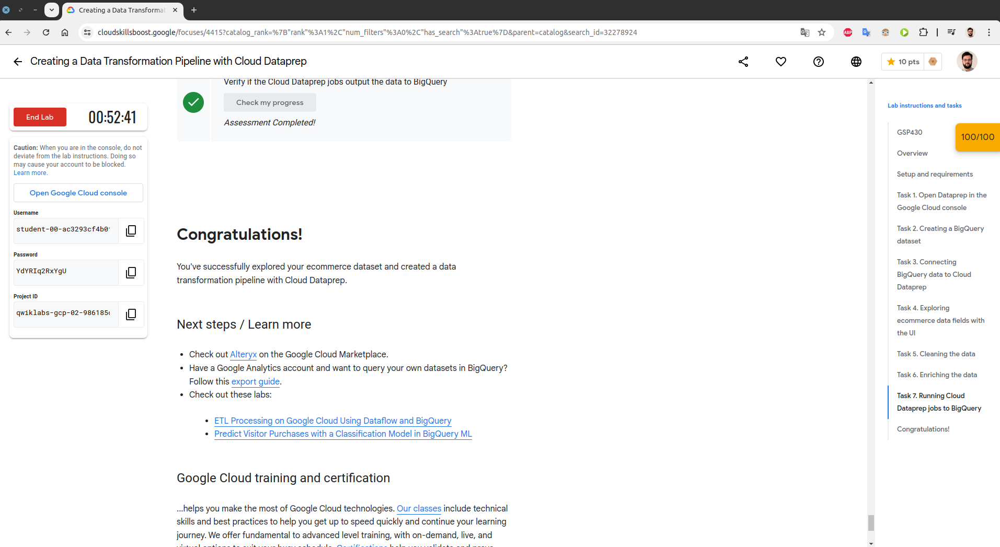
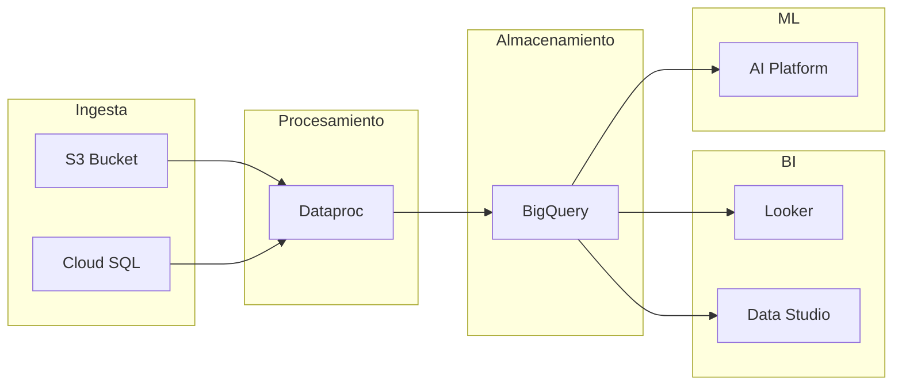

### Capturas de tablas GSkills <b>dbeaver</b>

### Contestar las siguientes preguntas:
1. ¿Para que se utiliza data prep?
2. ¿Qué cosas se pueden realizar con DataPrep?
3. ¿Por qué otra/s herramientas lo podrías reemplazar? Por qué?
4. ¿Cuáles son los casos de uso comunes de Data Prep de GCP?
5. ¿Cómo se cargan los datos en Data Prep de GCP?
6. ¿Qué tipos de datos se pueden preparar en Data Prep de GCP?
7. ¿Qué pasos se pueden seguir para limpiar y transformar datos en Data Prep de GCP?
8. ¿Cómo se pueden automatizar tareas de preparación de datos en Data Prep de GCP?
9. ¿Qué tipos de visualizaciones se pueden crear en Data Prep de GCP?
10. ¿Cómo se puede garantizar la calidad de los datos en Data Prep de GCP?

---
> Respuesta 1

DataPrep se utiliza para el trabajo de curación de datos, es decir limpiar, cambiar tipos, filtrar, y preparar datos para el análisis y procesamiento. Siendo simplista podría decir que es una UI para para limpieza de datos de un Big Data sin necesidad de usar código.

---
> Respuesta 2

Es posible realizar lo siguiente:
* Limpieza de datos
* Transformación de datos
* Enriquecer datos usando más de un source
* Visualizar distrubuciones de datos
* Permite la integración con otros servicios de GCP, Cloud Storage, Big Query, etc.

---
> Respuesta 3

Podría ser reemplazado por otros productos como por ej:
* Apache Spark y Databricks
* Pandas
* Excel
* Alteryx
Cada uno de las alternativas no ofrecen la totalidad de las features que tiene DataPrep, por ello la decisión de la herramienta a utilizar depende de la infraestructura y objetivos del proyecto.

---
> Respuesta 4

Casos comunes:
* Preparación de datos para análisis en BigQuery
* Limpieza y normalización de datos
* Transformación de datos en bruto provenientes de diferentes fuentes para su análisis
* Creación de conjuntos de datos para entrenamiento de modelos de Machine Learning

---
> Respuesta 5

Se cargan de varias maneras, es posible subir archivos del sistema local, importar datos de otros servicios de GCP, accediendo a tablas o vista de BQ, y conectando el pipe a otras fuentes de datos

---
> Respuesta 6

Solamente datos estructurados o bien datos tabulares por ejemplo, csv, parquet, JSON, tablas de BQ, vistas etc.

---
> Respuesta 7

Pasos: 
    1. Importar los datos (las fuentes dependen de cada proyecto en particular) 
    2. Explorar los datos para identificar valores nulos o duplicados. 
    3. Aplicar transformaciones para limpiar los datos, como eliminar duplicados, imputar valores nulos, cambiar formatos de fechas, etc. 
    4. Realizar agregaciones y uniones con otros conjuntos de datos si es necesario. 
    5. Validar las transformaciones aplicadas. 
    6. Correr el job, es posible guardar o exportar los datos transformados para su uso posterior.

---
> Respuesta 8

Es posible programar un schedule que permita ejecutar periodicamente un pipeline definido por el usuario, parecido a Cloud Composer de GCP, los recips pueden utilizarse para nuevo conjunto de datos.

---
> Respuesta 9

Visualizaciones:
* Histogramas
* Gráficos de barra y línea
* Diagramas de dispersión

---
> Respuesta 10

Para garantizar la calidad de los datos usando Data Prep, se podría realizar las siguiente tareas:
* Aplicar reglas de validación y transformación para limpiar los datos.
* Revisar las transformaciones y resultados intermedios para asegurar que los datos se están procesando correctamente.
* Automatizar tareas de limpieza y validación para mantener la consistencia de los datos.
* Utilizar alertas y monitoreo para detectar y corregir problemas de calidad de datos de manera proactiva.

---

### Arquitectura

#### Arquitectura de Datos en GCP

Esta arquitectura contempla las siguientes etapas: Ingesta, Procesamiento, Almacenamiento, BI y ML usando servicios de GCP.

